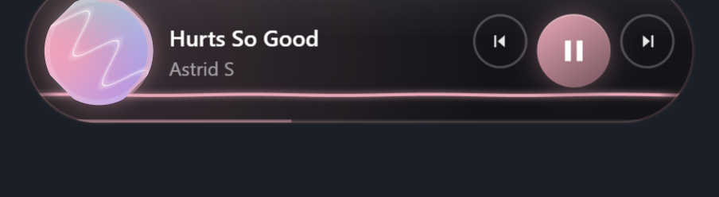

# 灵动岛 (Q-Dynamic-Island)

[](https://www.electronjs.org/)
[](https://www.microsoft.com/windows)
[](LICENSE)
[](https://github.com/StrangeHamburger/Q-Dynamic-Island/releases)

Windows 桌面悬浮「灵动岛」——显示并控制正在播放的音乐，带悬停放大、贴顶收拢、点击穿透、波浪可视化等动效。基于 Electron + 系统媒体会话（GSMTC）实现。

## 功能演示

| 悬停放大态（显示封面 / 进度环 / 控制按钮） | 拖到屏幕顶端收拢成细条（波浪律动） |
|---|---|
|  |  |

## ✨ 特性

- **🎵 音乐信息实时显示**：标题 / 歌手 / 封面 / 播放进度 / 播放状态
- **🎮 音乐控制**：播放 / 暂停 / 上一首 / 下一首，点击封面同样可播放 / 暂停
- **📐 悬停放大**：鼠标悬停时优雅放大，露出控制按钮；移开自动收回
- **📌 贴顶收拢**：拖到屏幕顶端收拢成 16px 细条，波浪持续律动
- **🖱️ 点击穿透**：透明区域不拦截鼠标，不挡桌面操作（无「虚拟墙」）
- **📊 波浪可视化**：读取系统音频 FFT，四种形态（波浪 / 柱状 / 涟漪 / 流光）+ 自动增益与节拍检测
- **🖼️ 封面取色**：从专辑封面提取主色，动态渲染按钮与光晕配色
- **⚙️ 右键菜单**：缩放、背景透明度、固定位置、可视化形态切换、退出
- **🖥️ 独立菜单窗口**：菜单开合不影响岛窗口动画，无闪烁
- **📦 打包分发**：NSIS 安装包 + 免安装便携版，托盘图标常驻

## 🎧 支持的音乐播放器

| 播放器 | 说明 |
|---|---|
| 汽水音乐 | ✅ 走系统媒体会话（GSMTC），信息最全 |
| QQ音乐 / 酷狗音乐 | ✅ 接 GSMTC 时信息最全；无会话时读窗口标题，封面在线搜索，播放状态乐观估算 |
| 网易云音乐 | ❌ 暂不支持（客户端禁用了系统媒体会话与媒体键，无法可靠控制） |

## 📋 环境要求

- **Windows 10 / 11**（依赖系统媒体会话 WinRT API，仅 Windows）
- Node.js + npm
- **无需 .NET SDK**（音乐桥接走 PowerShell）

## 🚀 安装 & 运行

```bash
git clone https://github.com/StrangeHamburger/Q-Dynamic-Island.git
cd Q-Dynamic-Island
npm install
npm start
```

### 国内加速（Electron 二进制默认从 GitHub 下载会失败）

`npm install` 前加环境变量，二选一：

```bash
# 方式一：一次性
ELECTRON_MIRROR=https://npmmirror.com/mirrors/electron/ npm install

# 方式二：全局设置一次，之后 npm install 都不用再带
npm config set electron_mirror https://npmmirror.com/mirrors/electron/
npm install
```

## 🕹️ 使用

- **左键点击岛**：播放 / 暂停 / 切歌
- **悬停**：放大
- **拖到屏幕顶端**：贴顶收拢成细条
- **右键**：菜单（缩放、背景透明度、固定位置、可视化形态、退出）
- **托盘图标**：显示 / 退出

## 📦 打包发布（生成 Windows 安装包）

```bash
npm run dist
```

产物在 `dist/` 目录：

| 文件 | 说明 |
|---|---|
| `灵动岛 Setup 0.1.0.exe` | NSIS 安装包（可选安装目录、桌面快捷方式） |
| `灵动岛-0.1.0-portable.exe` | 便携版，免安装双击即用 |

打包时 electron-builder 需要从 GitHub 下载 NSIS 等工具，国内可加镜像：

```bash
ELECTRON_BUILDER_BINARIES_MIRROR=https://npmmirror.com/mirrors/electron-builder-binaries/ npm run dist
```

> 打包时 `gsmtc.ps1` 会被复制到 `resources/` 目录（`music.js` 已支持打包后路径），源文件仍保留 UTF-8 BOM。

## 🛠️ 技术栈与架构

- **Electron**：主进程 + 渲染进程（`contextIsolation` 安全隔离）
- **系统媒体会话**：PowerShell 桥接 Windows GSMTC API，无需 .NET SDK
- **原生 Canvas**：波浪可视化（FFT 频谱 → 多形态绘制）
- **封面取色**：封面图主色提取 → CSS 变量动态配色

```
主进程（main.js / music.js / cover.js）
 ├── GSMTC 桥接（gsmtc.ps1 持久进程，行协议 JSON 通信）
 ├── 窗口管理（锚定 / 贴顶 / 缩放 / 点击穿透）
 ├── 独立菜单窗口（menu.html）
 └── 系统托盘
渲染进程（renderer/）
 ├── index.html + style.css    岛屿 UI
 ├── renderer.js               状态渲染 / 拖拽 / 交互
 ├── visualizer.js             波浪可视化（wave/bars/ripple/sweep）
 └── menu.html + menu.css + menu.js  右键菜单
```

## ⚠️ 说明与限制

- 仅 Windows。
- 封面在线搜索需要联网。
- QQ音乐 / 酷狗音乐无系统媒体会话时，播放状态为乐观估算（真实暂停态读不到）。
- 网易云音乐客户端禁用系统媒体会话，暂不支持。

## 🔧 开发注意

- **`.ps1` 文件必须带 UTF-8 BOM**：Windows PowerShell 5.1 会把无 BOM 的 UTF-8 `.ps1` 按 GBK 读，中文字符串会乱码导致解析错误。用编辑器改 `.ps1` 后务必存成「UTF-8 with BOM」。
- 音乐桥接：`music.js` 会 spawn 一个持久 PowerShell 进程 `gsmtc.ps1`，用行协议（`get/play/pause/next/prev/toggle/quit` → JSON）通信，无需额外构建步骤。

## 📄 License

[MIT](LICENSE)